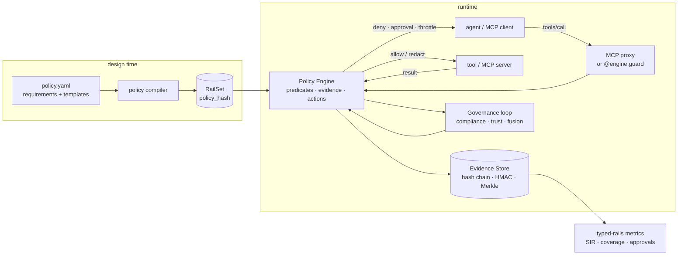

# agent-tool-guardrails

**Typed policy rails for agent-tool calls: compile declarative requirements into executable `⟨Type, Predicate, Evidence, Action⟩` rails, enforce them in-process or through an MCP proxy, and keep a tamper-evident evidence trail.**

[](https://github.com/nunar-nexus-forge/agent-tool-guardrails/actions/workflows/ci.yml)
[](https://pypi.org/project/agent-tool-guardrails/)
[](pyproject.toml)
[](LICENSE)

Most agent guardrails are filters bolted on after the fact: a prompt classifier here, an
allow/deny list there, nothing an auditor can trace from a regulation to a blocked call.
`agent-tool-guardrails` makes governance a **first-class architectural connector** between agents and
tools - typed rails that sit between every agent and every tool - and adds two things most
guardrail layers lack:

* a **policy compiler** that turns declarative requirements (GDPR anonymisation, approval
  thresholds, data residency, PII redaction, rate limits, trust gates ...) into executable
  rails, from *one configuration file*;
* a cryptographically verifiable **Evidence Store** so every predicate evaluation, every
  enforcement and every human approval is an append-only, hash-chained, signed record.

It ships as an **MCP proxy**: wrap any Model Context Protocol server command and every
`tools/call` is evaluated with zero changes to the client or the server. Trust-scored
governance (compliance scores, evolving trust, fusion thresholds, policy-driven memory
sharding) throttles or isolates agents that keep violating policy.

> **Naming:** the distribution is `agent-tool-guardrails`; the enforcement model is called
> Typed Rails, so the import is `from typed_rails import ...` and the CLI is `typed-rails <command>`.

---

## Install

```bash
pip install agent-tool-guardrails                 # PyYAML is the only dependency
pip install 'agent-tool-guardrails[langchain]'    # + guard LangChain tools
```

## 60-second tour

**1. Write requirements, not code** - `policy.yaml`:

```yaml
version: 1
name: finance
defaults: {on_fail: deny}
requirements:
  - id: gdpr-anonymised-exports          # a raw rule: Type + Predicate + Evidence + Action
    type: privacy
    tools: [export_report]
    predicate: "evidence.anonymised == true"
    evidence: [anonymised]
    on_fail: {action: redact, fields: [args.customer.email, args.customer.name]}
    citation: "GDPR Art. 5(1)(c)"
  - template: approval_threshold         # templates capture recurring regulatory patterns
    tool: transfer_funds
    field: args.amount
    threshold: 1000
  - template: pii_redaction
    tools: ["*"]
  - template: trust_gate
    tools: [execute_code]
    min_trust: 0.7
  - template: rate_limit
    tools: [search]
    max_calls: 30
    per_seconds: 60
  - template: deny_tools
    tools: [drop_database]
```

```bash
typed-rails compile policy.yaml -o finance.rails.json     # validate + compile (content-addressed policy hash)
typed-rails explain policy.yaml                            # Markdown table of every rail
typed-rails check policy.yaml --tool transfer_funds --args '{"amount": 5000}'   # -> REQUIRE_APPROVAL, exit 1
```

**2. Enforce with zero code changes - the MCP proxy:**

```bash
typed-rails proxy --policy policy.yaml --evidence evidence.jsonl -- npx -y @modelcontextprotocol/server-filesystem /data
```

Point Claude Desktop / Cursor / your agent framework at that command instead of the server.
Denied calls come back as MCP tool errors the model can read and recover from; arguments
and results are redacted in flight; tools an agent can never call disappear from
`tools/list`; every decision lands in `evidence.jsonl`.

```bash
typed-rails evidence evidence.jsonl verify      # OK: 42 record(s), chain intact  + Merkle root
typed-rails metrics evidence.jsonl              # coverage, safety incident rate, redactions, approvals, per rail / per agent
```

**3. Or enforce in-process:**

```python
from typed_rails import compile_policy, PolicyEngine, CallContext, PolicyDenied

engine = PolicyEngine(compile_policy("policy.yaml"))


@engine.guard("transfer_funds", agent="treasury-bot")  # pre-conditions before, post-conditions after
def transfer_funds(amount: float, to: str) -> str: ...


decision = engine.evaluate(
    CallContext(tool="export_report", args={"customer": {"email": "a@b.com"}}, agent="analyst")
)
print(decision.explain())
# REDACT analyst -> export_report [pre] (2 rail(s))
#   - gdpr-anonymised-exports [privacy/tool] FAIL -> redact missing evidence: anonymised (GDPR Art. 5(1)(c))
#   - pii-redaction-2 [privacy/tool] FAIL -> redact
#   redacted: args.customer.email, args.customer.name
print(engine.evidence.verify())  # OK: 1 record(s), chain intact
```

## The model

| Element | In the code | What it captures |
|---|---|---|
| **Type** `T` | `RailType(risk, capability)` | hierarchical types: risk (`safety`, `privacy`, `compliance`, `security`, `cost`, `quality`) × capability (`tool`, `api`, `memory`, `data`, `message`, `code`) |
| **Predicate** `P` | `Predicate("agent.trust >= 0.7 and not has_pii(args)")` | a safe expression over `tool`, `args`, `agent`, `evidence`, `session`, `env`, `time`, `result` - no `eval`, missing paths are `null` |
| **Evidence** `E` | `EvidenceSpec(required=[...], capture=[...])` | evidence keys the predicate needs (auth tokens, anonymisation flags, tickets, regions); what to snapshot into the audit record |
| **Action** `A` | `ActionSpec(action, fields, message, retry_after_s)` | `allow`, `log`, `redact`, `throttle`, `require_approval`, `quarantine`, `deny` on fail (and optionally on pass) |

`Allow(agent, action) = 1` iff every applicable rail's predicate holds over its evidence.
Rails have a **selector** (tool and agent globs, `pre`/`post` phase) and the most severe
action across applicable rails wins; redactions accumulate. Post-phase rails see the tool
**result** and can redact or reject it.

### Templates

`allowed_tools`, `deny_tools`, `approval_threshold`, `rate_limit`, `trust_gate`,
`pii_redaction`, `output_pii_redaction`, `time_window`, `data_residency`,
`purpose_limitation`, `sandbox_required`, `max_output_size`, `evidence_required`,
`forbidden_patterns`. Each compiles to an ordinary rail (run `typed-rails explain` to see
the generated predicate), so you can always fall back to a raw rule.

### Predicate language

```
tool == "transfer_funds" and args.amount > 1000
evidence.region in ["EU", "UK"] and time.hour >= 8 and time.hour < 18
matches(args.sql, "(?i)drop\s+table") or args.query contains "rm -rf"
count_pii(result) == 0
rate(tool, 60) < 30                       # provided by the engine
len(args.items) <= 100 and all(args.flags)
```

Operators `and or not == != < <= > >= in "not in" matches contains startswith endswith + - * / %`;
functions `len lower upper str int float abs min max sum any all exists keys values matches
contains startswith endswith now age count_pii has_pii pii_kinds round`. Regular expressions
are bounded and errors fail closed by default.

### Evidence Store

```python
from typed_rails import EvidenceStore

store = EvidenceStore("evidence.jsonl", hmac_key=os.environ["RAILS_KEY"])
engine = PolicyEngine(rails, evidence=store)
...
store.verify()  # hash chain + HMAC signatures
store.merkle_root()  # commit to (or timestamp) the whole log in one hash
store.query(agent="analyst", action="deny")
```

Records carry the rail evaluations, the evidence the predicate saw (PII-redacted), digests
of the raw arguments/results, the redactions applied and the `policy_hash` of the compiled
rules in force - the traceability an auditor needs from "which rule" to "which call".

### Trust-scored governance

```python
from typed_rails import GovernanceLoop, GovernanceConfig

gov = GovernanceLoop(GovernanceConfig(lam=0.8, alpha=0.5, window=20, throttle_below=0.6, isolate_below=0.4))
engine = PolicyEngine(rails, governance=gov)
```

Every decision updates the agent's **compliance score** `C_i` (allowed actions over the
last *K*) and **trust** `T_i ← λT_i + (1−λ)E_i`; the **fusion** `G_i = αC_i + (1−α)T_i`
throttles then isolates agents that keep violating policy - automatically, in the same
engine. Predicates can read the agent's trust (`agent.trust`) and the loop's
strictness knob (`env.strictness`, driven by `gov.adapt(delta_risk)`), and
`ShardedMemory` applies the same predicate gating to policy / context / analytics memory
shards with auditable lineage.

## Architecture



## CLI

```
typed-rails compile  policy.yaml [-o rails.json]
typed-rails explain  policy.yaml
typed-rails check    policy.yaml --tool T [--agent A] [--trust 0.8] [--args JSON] [--evidence JSON] [--result JSON] [--json]
typed-rails proxy    --policy policy.yaml [--evidence file.jsonl] [--agent NAME] [--static-evidence JSON] [--hmac-key-env VAR] [--no-hide] -- <server command>
typed-rails evidence file.jsonl [--hmac-key-env VAR] verify | show [--last N] [--json] | export OUT
typed-rails metrics  file.jsonl [--json]
```

## Scope

The engine enforces the rules you compile and reports what it measures on your traffic; it
makes no safety claims of its own. Longer documents live in `docs/`:
[policy-language.md](docs/policy-language.md) (document schema, templates, predicate
namespace, action combination) and [architecture.md](docs/architecture.md) (viewpoints,
enforcement sequence, trust boundary). To cite the software, use [CITATION.cff](CITATION.cff).

## Companion projects

- [`multi-agent-observability`](https://github.com/nunar-nexus-forge/multi-agent-observability) - causal tracing, coordination SLOs and deterministic replay for multi-agent systems.
- [`agent-chaos-engineering`](https://github.com/nunar-nexus-forge/agent-chaos-engineering) - fault injection and self-healing recovery patterns.

## Contributing

See [CONTRIBUTING.md](CONTRIBUTING.md). Most wanted: more requirement templates (HIPAA
minimum-necessary, PCI-DSS scope, SOC 2 change control), Streamable-HTTP MCP proxying, and
adapters for the OpenAI Agents SDK and Semantic Kernel.

```bash
git clone https://github.com/nunar-nexus-forge/agent-tool-guardrails && cd agent-tool-guardrails
make sync && make check          # everything lives in ./.venv
python examples/guard_demo.py
```

## License

Apache License 2.0 - see [LICENSE](LICENSE) and [NOTICE](NOTICE).
