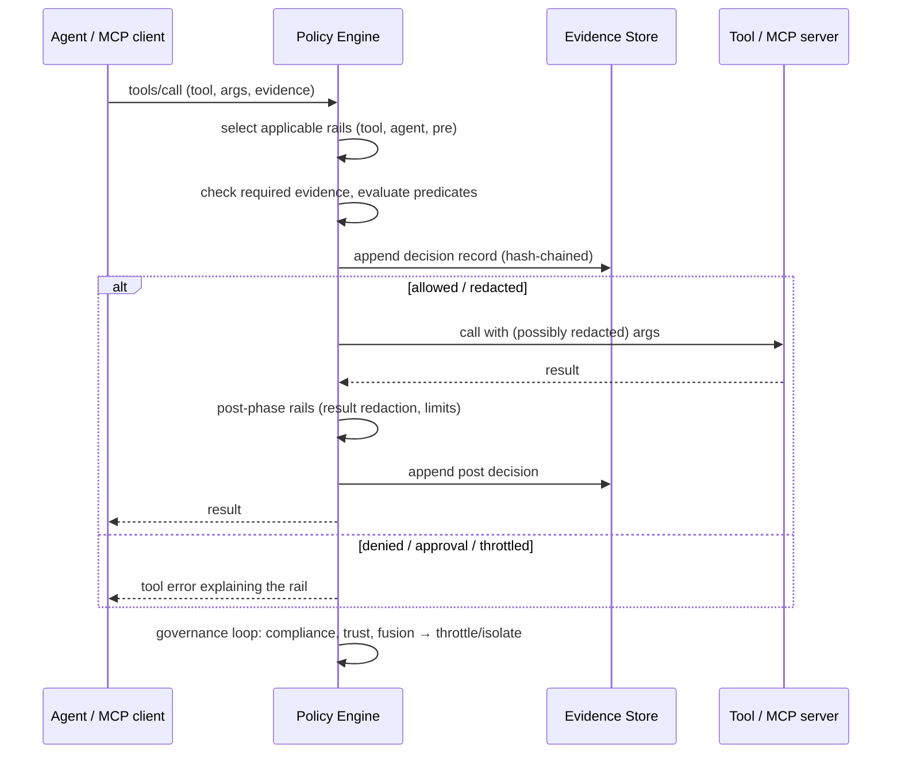

# Architecture viewpoints

| viewpoint | elements | in this repository |
|---|---|---|
| Logical | agents, tools, Typed Rails as connectors | `Rail`, `RailSet`, `Selector` - a rail connects a set of agents to a set of tools with a contract |
| Process | sequence of enforcement and message exchange | `PolicyEngine.evaluate` (pre) → tool → `evaluate_result` (post); the MCP proxy applies the same sequence to JSON-RPC traffic |
| Policy | policy engine and evidence store, audit trail and compliance verification | `PolicyEngine`, `EvidenceStore`, `GovernanceLoop`, `typed_rails.metrics` |
| Implementation | integration APIs and adapters | `engine.guard`, `guard_langchain_tool`, `typed-rails proxy`, the CLI |

## Enforcement sequence

## Trust boundary

The engine trusts the compiled `RailSet` and its own evidence store; everything arriving in
a call (arguments, evidence, MCP `_meta`) is untrusted input that predicates reason over.
Predicates cannot execute code; regular expressions are bounded; evaluation errors fail
closed. Evidence records never contain raw arguments - only PII-redacted snapshots and
SHA-256 digests - so the log can be shared with auditors.
